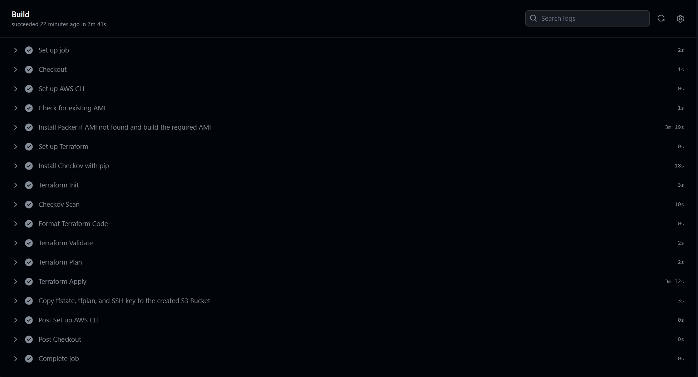

# NextCloud on AWS using DevOps Practices
##### Telerik Academy DevOps UpSkill Final Project - 2023-2024 #####
## Table of Contents

- [Overview](#overview)
- [Repo Structure](#Repo-Structure)
- [CICD Workflow Details](#CICD-Workflow)
- [Packer Details](#Immutable-Infrastructure-with-Hashicorp-Packer)
- [Terraform IaC Details](#Terraform-IaC-Details)
- [Ansible Config Management Details](#Ansible-Configuration-Managmenet)
- [Usage and Requirements](#Usage-Requirements)
- [Possible Future Improvements](#Future-Improvements:)
- [License](#License)

## Quick Overview

The primary goal of this project is to demonstrate a comprehensive CI/CD pipeline by deploying a Dockerized NextCloud application on AWS using set of DevOps practices such as:

- Branching Strategies, CICD, AWS Cloud, Packer - immutable infrastructure, Terraform Code, Security Checks with Chekov, Code Format, Code Validation, Configuration Management (Ansible) Installation, Instance Configuration management from central management system, Docker, Cutom Docker Application (image) deployment.

## Repo Structure
```
.
├── ansible
│   └── instance-config.yml  <-- EC2 Ansible Config
├── app  <--application folder
│   ├── compose.yaml  <-- NextCloud YAML File for Docker
│   ├── output.jpg
│   └── README.md  <-- Basic Information about the NextCloud
├── LICENSE  <-- Repo LICENSE file
├── packer
│   └── packer.pkr.hcl <--packer file
├── README.md  <-- Thi README.md file
└── terraform  <-- Terraform Code folder
    ├── main.tf  <-- Main Terraform File
    ├── outputs.tf  <-- Outputs the infrastructure Details
    ├── terraform.tf  <-- TF Modules Version
    └── variables.tf  <-- Variables File
```
## CICD Workflow Details
``````
.git/workflows/terraform.yaml
``````
Defines several jobs as a complete CICD Pipeline
- Setup AWS Cli by exporting access key and secret access key to the build environment
- Setup Terraform using hashicorp/setup-terraform@v1
- Installs Checkov using Python PIP
- Terraform init - initiates the terraform code
- Checkov Scan - performs an security scan with Chekov, the pipeline will not continue if Checkov scan fails
- Formats terraform code using terraform fmt
- Performs Terraform Code validation using terraform validate, if the validation fails the pipeline will not continue
- Creates terraform plan with output to tfplan file
- Finally if the above mentioned checks are passed, then terraform apply with auto-approve is executed to build the AWS environment
- As a final step, once the EC2 environment is built using the terraform code, the pipeline copies the tfstate (terraform state file), MyAWSKey.pem (private key for EC2 management*) and tfplan file to a private S3 Bucket.
- * The Infrastructure administrator can download the MyAWSKey.pem file and use ssh -i MyAWSKey.pem ubuntu@Public-IP-Address in order to connect and manually manage the EC2 VM.
- The below image shows the completed CICD Pipeline in GitHub:



## Immutable Infrastructure with Hashicorp Packer:
### Packer Template for Ubuntu AMI

This part of the project contains a Packer template for building an Amazon Machine Image (AMI) with Ubuntu 22.04 using the `amazon-ebs` builder. The resulting AMI is named "telerik-demo-ami" and is configured for use in the `us-east-1` region with an instance type of `t2.micro`.

Packer Configuration

The Packer template utilizes the `amazon-ebs` builder with the following configuration:

- **AMI Name**: "telerik-demo-ami"
- **Instance Type**: "t2.micro"
- **Region**: "us-east-1"
- **Source AMI Filter**:
  - Filters for the latest Ubuntu 22.04 AMD64 server image.
  - Filters for EBS root device type and HVM virtualization type.
  - Owner set to Canonical (owner ID: "099720109477").
- **SSH Username**: "ubuntu"

How to Use

1. Install Packer on your local machine.
2. Clone this repository and navigate to the `./packer` folder
3. Review and customize the Packer template (`packer.pkr.hcl`) if needed.
4. Run the Packer build command: `packer build ubuntu-ami.pkr.hcl`.

The resulting AMI will be available in your AWS account with the specified name ("telerik-demo-ami") and configuration.

## Terraform IaC Details:


## Ansible Configuration Managmenet:


## Usage requirements:
- In order to use this project and manually create the infrastructure you need to have AWS account and Terraform installed locally, Terraform modules version is outlined in terraform/terraform.tf file
``````hcl
          terraform.tf

terraform {
  required_version = ">=1.0.6"
  required_providers {
    aws = {
      source  = "hashicorp/aws"
      version = "~> 5.0"
    }
    random = {
      source  = "hashicorp/random"
      version = "~> 3.1.0"
    }

    http = {
      source  = "hashicorp/http"
      version = "~> 2.1.0"
    }

    local = {
      source  = "hashicorp/local"
      version = "~> 2.1.0"
    }

    tls = {
      source  = "hashicorp/tls"
      version = "~> 4.0.0"
    }
  }
}
``````
- Once you have terraform installed locally nagivate to terraform folder and execute the following commands in your terminal:

```bash
terraform init
terraform plan #review the provided plan
terraform apply #confirmation will be requred
```
## Future Improvements:
Migrate the application to Kubernetes (AWS EKS)
Implement Observavility Tools

## License: